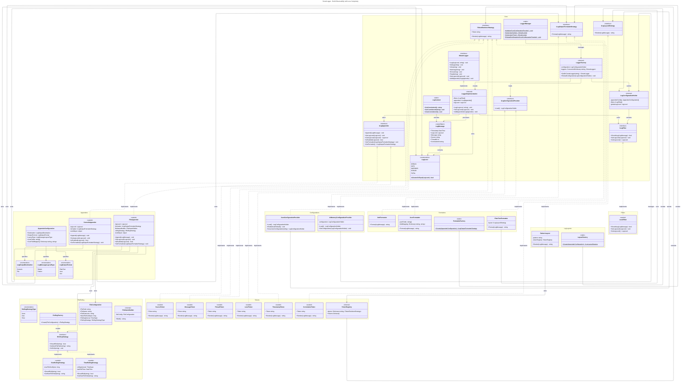

```mermaid
---
title: SmartLogger - Build Observability with Less Complexity
config:
    classdiagram:
        arrowType: aggregation
    layout: elk

---
classDiagram
    direction TB
    
    %% ============================================================================
    %% CORE PACKAGE - Central logging interfaces and orchestration
    %% ============================================================================
    namespace Core {
        class LogLevel {
            <<enumeration>>
            DEBUG
            INFO
            WARNING
            ERROR
            FATAL
            IsGreaterOrEqual(LogLevel) bool$
        }

        class LogMessage {
            <<valueObject>>
            +Timestamp DateTime
            +LogLevel LogLevel
            +Message string
            +Source string
            +ThreadId int
            +CorrelationId string
        }

        class ISmartLogger {
            <<interface>>
            +Log(LogLevel, string) void*
            +Debug(string) void*
            +Info(string) void*
            +Warning(string) void*
            +Error(string) void*
            +Fatal(string) void*
            +SetLogLevel(LogLevel) void*
            +AddAppender(ILogAppender) void*
        }

        class LoggerImplementation {
            <<internal>>
            -filters: ILogFilter[]
            -appenders: ILogAppender[]
            -logLevel: LogLevel
            +Log(LogLevel, string) void
            +SetLogLevel(LogLevel) void
            +AddAppender(ILogAppender) void
        }

        class ILogAppender {
            <<interface>>
            +Append(LogMessage) void*
            +SetLogLevel(LogLevel) void*
            +GetLogLevel(LogLevel) LogLevel*
            +IsEnabled(LogLevel) bool*
            +SetFormatter(ILogOutputFormatterStrategy) void*
            +GetFormatter() ILogOutputFormatterStrategy*
        }

        class ILogConfigurationProvider {
            <<interface>>
            +Load() LogConfigurationHolder*
        }

        class ILogFilter {
            <<interface>>
            +ShouldLog(LogMessage) bool*
            +SetLogLevel(LogLevel) void*
            +GetLogLevel() LogLevel*
        }

        class ILogLayoutStrategy {
            <<interface>>
            +Render(LogMessage) string*
        }

        class ILogOutputFormatterStrategy {
            <<interface>>
            +Format(LogMessage) string*
        }

        class ITokenRendererStrategy {
            <<interface>>
            +Token string*
            +Render(LogMessage) string*
        }

        class LogConfigurationHolder {
            <<internal>>
            -appenderConfigs: AppenderConfiguration[]
            -filters: ILogFilter[]
            -globalLogLevel: LogLevel
        }

        class LoggerFactory {
            <<internal>>
            -configuration: LogConfigurationHolder
            -loggers: ConcurrentDictionary~string, ISmartLogger~
            +GetOrCreateLogger(string) ISmartLogger
            +ReloadConfiguration(LogConfigurationHolder) void
        }

        class LoggerManager {
            <<static>>
            +Initialize(ILogConfigurationProvider) void$
            +GetLogger(string) ISmartLogger$
            +GetLogger(Type) ISmartLogger$
            +ReloadConfiguration(ILogConfigurationProvider) void$
        }

        class LogContext {
            <<static>>
            +GetCorrelationId() string$
            +SetCorrelationId(string) void$
            +ClearCorrelationId() void$
        }
    }

    %% ============================================================================
    %% APPENDERS PACKAGE - Output destinations
    %% ============================================================================
    namespace Appenders {
        class ConsoleAppender {
            <<sealed>>
            -logLevel: LogLevel
            -formatter: ILogOutputFormatterStrategy
            -lockObject: object
            +Append(LogMessage) void
            +SetLogLevel(LogLevel) void
            +IsEnabled(LogLevel) bool
            +SetFormatter(ILogOutputFormatterStrategy) void
        }

        class FileAppender {
            <<sealed>>
            -logLevel: LogLevel
            -formatter: ILogOutputFormatterStrategy
            -fileNameBuilder: FileNameBuilder
            -rollingStrategy: IRollingStrategy
            -lockObject: object
            +Append(LogMessage) void
            +SetLogLevel(LogLevel) void
            +IsEnabled(LogLevel) bool
            +SetFormatter(ILogOutputFormatterStrategy) void
        }

        class AppenderConfiguration {
            +Destination: LogOutputDestination
            +OutputFormat: LogOutputFormat
            +LayoutType: LogMessageLayoutType
            +JsonFields: string[]
            +JsonFieldMapping: Dictionary~string, string~
        }

        class LogOutputDestination {
            <<enumeration>>
            Console
            File
        }

        class LogOutputFormat {
            <<enumeration>>
            PlainText
            Json
            Xml
        }

        class LogMessageLayoutType {
            <<enumeration>>
            Simple
            Pattern
        }
    }

    %% ============================================================================
    %% FILE ROLLING PACKAGE - File rolling strategies
    %% ============================================================================
    namespace FileRolling {
        class IRollingStrategy {
            <<interface>>
            +ShouldRoll(string) bool*
            +GetNextFilePath(string) string*
            +OnRoll(string) void*
        }

        class SizeRollingStrategy {
            <<sealed>>
            -maxFileSizeBytes: long
            +ShouldRoll(string) bool
            +GetNextFilePath(string) string
        }

        class TimeRollingStrategy {
            <<sealed>>
            -rollingInterval: TimeSpan
            -lastRollTime: DateTime
            +ShouldRoll(string) bool
            +GetNextFilePath(string) string
        }

        class FileNameBuilder {
            <<internal>>
            -fileConfig: FileConfiguration
            +Build() string
        }

        class FileConfiguration {
            +FilePath: string
            +FileName: string
            +FileExtension: string
            +MaxFileSizeBytes: long
            +RollingInterval: TimeSpan
            +RollingStrategy: RollingStrategyType
        }

        class RollingStrategyType {
            <<enumeration>>
            None
            Size
            Time
        }

        class RollingFactory {
            +Create(FileConfiguration) IRollingStrategy*
        }
    }

    %% ============================================================================
    %% CONFIGURATIONS PACKAGE - Configuration providers
    %% ============================================================================
    namespace Configurations {
        class JsonConfigurationProvider {
            +Load() LogConfigurationHolder
            +EnableAutoReload() void
            -ParseJsonConfiguration(string) LogConfigurationHolder
        }

        class InMemoryConfigurationProvider {
            -configuration: LogConfigurationHolder
            +Load() LogConfigurationHolder
            +SetConfiguration(LogConfigurationHolder) void
        }
    }

    %% ============================================================================
    %% FORMATTERS PACKAGE - Output formatting
    %% ============================================================================
    namespace Formatters {
        class FormatterFactory {
            <<static>>
            +Create(AppenderConfiguration) ILogOutputFormatterStrategy$
        }

        class PlainTextFormatter {
            -layout: ILogLayoutStrategy
            +Format(LogMessage) string
        }

        class JsonFormatter {
            -jsonFields: string[]
            -fieldMapping: Dictionary~string, string~
            +Format(LogMessage) string
        }

        class XmlFormatter {
            +Format(LogMessage) string
        }
    }

    %% ============================================================================
    %% LOG LAYOUTS PACKAGE - Pattern-based layout rendering
    %% ============================================================================
    namespace LogLayouts {
        class LayoutFactory {
            <<static>>
            +Create(AppenderConfiguration) ILogLayoutStrategy$
        }

        class PatternLayout {
            -pattern: string
            -tokenRegistry: TokenRegistry
            +Render(LogMessage) string
        }
    }

    %% ============================================================================
    %% TOKENS PACKAGE - Token rendering strategies
    %% ============================================================================
    namespace Tokens {
        class TokenRegistry {
            <<internal>>
            -tokens: Dictionary~string, ITokenRendererStrategy~
            +Tokens Dictionary*
        }

        class TimestampToken {
            <<sealed>>
            +Token string
            +Render(LogMessage) string
        }

        class LevelToken {
            <<sealed>>
            +Token string
            +Render(LogMessage) string
        }

        class MessageToken {
            <<sealed>>
            +Token string
            +Render(LogMessage) string
        }

        class SourceToken {
            <<sealed>>
            +Token string
            +Render(LogMessage) string
        }

        class ThreadToken {
            <<sealed>>
            +Token string
            +Render(LogMessage) string
        }

        class CorrelationToken {
            <<sealed>>
            +Token string
            +Render(LogMessage) string
        }
    }

    %% ============================================================================
    %% FILTERS PACKAGE - Log filtering
    %% ============================================================================
    namespace Filters {
        class LevelFilter {
            <<sealed>>
            +ShouldLog(LogMessage) bool
            +SetLogLevel(LogLevel) void
            +GetLogLevel() LogLevel
        }
    }

    %% ============================================================================
    %% RELATIONSHIPS & ASSOCIATIONS
    %% ============================================================================

    %% ISmartLogger relationships
    ISmartLogger <|.. LoggerImplementation : implements
    LoggerImplementation --> ILogAppender : uses*
    LoggerImplementation --> ILogFilter : uses*
    LoggerImplementation --> LogLevel : uses
    LoggerImplementation --> LogMessage : processes

    %% LoggerManager relationships
    LoggerManager --> LoggerFactory : manages
    LoggerFactory --> LoggerImplementation : creates
    LoggerFactory --> ILogConfigurationProvider : loads
    LoggerFactory --> LogConfigurationHolder : caches

    %% ILogAppender implementations
    ILogAppender <|.. ConsoleAppender : implements
    ILogAppender <|.. FileAppender : implements
    ConsoleAppender --> ILogOutputFormatterStrategy : uses
    ConsoleAppender --> LogLevel : uses
    FileAppender --> ILogOutputFormatterStrategy : uses
    FileAppender --> IRollingStrategy : uses
    FileAppender --> FileConfiguration : uses
    FileAppender --> LogLevel : uses

    %% Formatter relationships
    ILogOutputFormatterStrategy <|.. PlainTextFormatter : implements
    ILogOutputFormatterStrategy <|.. JsonFormatter : implements
    ILogOutputFormatterStrategy <|.. XmlFormatter : implements
    PlainTextFormatter --> ILogLayoutStrategy : uses
    FormatterFactory --> ILogOutputFormatterStrategy : creates

    %% Layout & Token relationships
    ILogLayoutStrategy <|.. PatternLayout : implements
    PatternLayout --> TokenRegistry : uses
    TokenRegistry --> ITokenRendererStrategy : contains
    ITokenRendererStrategy <|.. TimestampToken : implements
    ITokenRendererStrategy <|.. LevelToken : implements
    ITokenRendererStrategy <|.. MessageToken : implements
    ITokenRendererStrategy <|.. SourceToken : implements
    ITokenRendererStrategy <|.. ThreadToken : implements
    ITokenRendererStrategy <|.. CorrelationToken : implements
    LayoutFactory --> ILogLayoutStrategy : creates

    %% Configuration relationships
    ILogConfigurationProvider <|.. JsonConfigurationProvider : implements
    ILogConfigurationProvider <|.. InMemoryConfigurationProvider : implements
    JsonConfigurationProvider --> LogConfigurationHolder : returns
    InMemoryConfigurationProvider --> LogConfigurationHolder : manages

    %% Filter relationships
    ILogFilter <|.. LevelFilter : implements
    LogConfigurationHolder --> ILogFilter : contains

    %% Rolling strategy relationships
    IRollingStrategy <|.. SizeRollingStrategy : implements
    IRollingStrategy <|.. TimeRollingStrategy : implements
    RollingFactory --> IRollingStrategy : creates

    %% Appender configuration relationships
    AppenderConfiguration --> LogOutputDestination : specifies
    AppenderConfiguration --> LogOutputFormat : specifies
    AppenderConfiguration --> LogMessageLayoutType : specifies

    %% Data flow
    LogMessage --> LogLevel : contains
    LogContext --> LogMessage : enriches

    %% Style annotations
    style Core fill:#e1f5ff
    style Appenders fill:#f3e5f5
    style FileRolling fill:#fce4ec
    style Configurations fill:#e8f5e9
    style Formatters fill:#fff3e0
    style LogLayouts fill:#ffe0b2
    style Tokens fill:#f1f8e9
    style Filters fill:#e0f2f1
```