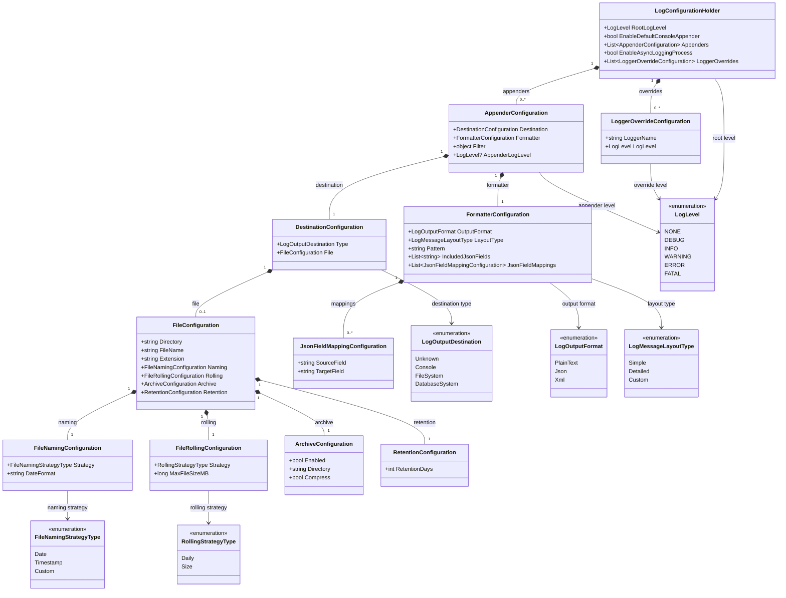

# SmartLogger Configuration Design at a Glance

### One-line descriptions

| Entity                          | Description                   |
| ------------------------------- | ----------------------------- |
| **LogConfigurationHolder**      | **Root configuration**        |
| `LoggerOverrideConfiguration`   | **Logger-level override**     |
| `AppenderConfiguration`         | **Output pipeline config**    |
| `DestinationConfiguration`      | **Where logs go**             |
| `FileConfiguration`             | **File logging config**       |
| `FileNamingConfiguration`       | **File naming strategy**      |
| `FileRollingConfiguration`      | **File rotation policy**      |
| `ArchiveConfiguration`          | **Rolled-file archival**      |
| `RetentionConfiguration`        | **Archive cleanup policy**    |
| `FormatterConfiguration`        | **Log formatting rules**      |
| `JsonFieldMappingConfiguration` | **JSON field mapping**        |
| `LogLevel`                      | **Logging severity**          |
| `LogOutputDestination`          | **Log destination type**      |
| `LogOutputFormat`               | **Log serialization format**  |
| `LogMessageLayoutType`          | **Message layout style**      |
| `FileNamingStrategyType`        | **File naming strategy type** |
| `RollingStrategyType`           | **File rotation strategy**    |

### Design intent

The hierarchy can be remembered as:

**`LogConfigurationHolder` => What + Where + How**

* **What**: `RootLogLevel`, `LoggerOverrides`

* **Where**: `Appender → Destination → File`

* **How**: `Formatter`

* **File lifecycle**: `Naming → Rolling → Archive → Retention`

This is written in a way to **show responsibilities and composition, not XML-style property documentation.**

<strong>© 2026 Srimani. All rights reserved.</strong>

